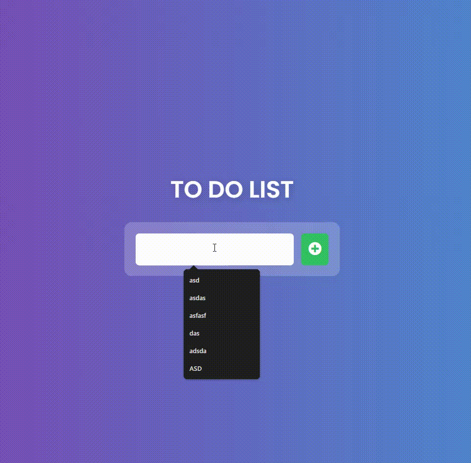

# 📌 Interactive To-Do List Application  

## 🎯 **Objective**  
A simple to-do list web application that allows users to:  
- Add new tasks  
- Mark tasks as complete  
- Undo completed tasks  
- Delete tasks  


---

## 📜 **How It Works**  

### **1️⃣ Add a Task**  
- Enter a task in the input field.  
- Click the **➕ Add button** or press enter.  
- The task will appear in the list.  

### **2️⃣ Mark a Task as Completed**  
- Click the ✅ **Check button** to mark a task as done.  
- The task gets a **strikethrough** effect and fades out slightly.  
- An **Undo button** appears.  

### **3️⃣ Undo a Completed Task**  
- Click the 🔄 **Undo button** to revert a completed task back to normal.  

### **4️⃣ Delete a Task**  
- Click the 🗑 **Trash button** to remove a task permanently.  

---

## 🛠 **Code Highlights**  

### **📌 Adding a Task**
```javascript
function addTodo(){
    console.log(todoInput.value);
    taskText = todoInput.value;
    if (taskText == "") {
        alert("Enter a task");
        return;
    }
    const taskDiv = document.createElement('div');
    taskDiv.classList.add('todo');

    const newTodo = document.createElement('li');
    newTodo.textContent = taskText;
    newTodo.classList.add("todo-item");
    taskDiv.appendChild(newTodo);

    // Buttons for task actions
    const completeButton = document.createElement('button');
    completeButton.innerHTML = '<i class="fas fa-check"></i>';
    completeButton.classList.add('complete-btn');
    completeButton.onclick = completeTask;
    taskDiv.appendChild(completeButton);

    const deleteButton = document.createElement('button');
    deleteButton.innerHTML = '<i class="fas fa-trash"></i>';
    deleteButton.classList.add('delete-btn');
    deleteButton.onclick = deleteTask;
    taskDiv.appendChild(deleteButton);
    
    const undoButton = document.createElement('button');
    undoButton.innerHTML = '<i class="fas fa-undo"></i>';
    undoButton.classList.add('undo-btn');
    undoButton.style.display = "none";
    undoButton.onclick = undoTask;
    taskDiv.appendChild(undoButton);

    todoList.appendChild(taskDiv);
}
```
✅ **Checks if input is empty** before adding a task.  
✅ **Creates elements dynamically** using `document.createElement`.  
✅ **Adds event listeners** to complete, undo, and delete tasks.  

### **📌 Mark Task as Completed**
```javascript
function completeTask(event) {
    const task = event.target.closest(".todo");  
    const undoButton = task.querySelector(".undo-btn"); 

    if (!task.classList.contains("completed")) {
        task.classList.add("completed");
        undoButton.style.display = "inline-block"; 
    } else {
        task.classList.remove("completed");
        undoButton.style.display = "none"; 
    }
}
```
✅ **Adds/removes "completed" class** to toggle task status.  
✅ **Displays/hides the Undo button** dynamically.  

### **📌 Undo Completed Task**
```javascript
function undoTask(event) {
    const task = event.target.closest(".todo");  
    const undoButton = task.querySelector(".undo-btn");

    task.classList.remove("completed"); 
    undoButton.style.display = "none"; 
}
```
✅ **Removes strikethrough effect** when undone.  
✅ **Hides Undo button** when task is back to normal.  

### **📌 Delete Task**
```javascript
function deleteTask(event) {
    const task = event.target.closest(".todo"); 
    task.remove(); 
}
```
✅ **Removes task from the DOM completely.**  

---

## 🎥 **Demo Video**  
[]  

**note** : the ouput quality is low because of the gif
---

