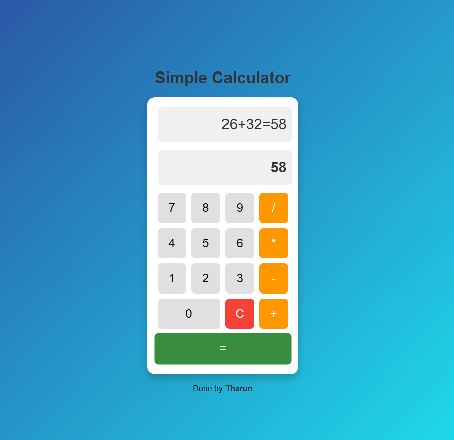

# Simple Calculator

## Overview
This is a simple web-based calculator built using **HTML, CSS, and JavaScript**. It supports basic arithmetic operations like **addition, subtraction, multiplication, and division**. The calculator provides a **dynamic display** for user inputs and operations.



---

## Features
- **Number and Operator Buttons**: Users can input numbers and perform arithmetic operations.
- **Dynamic Display**: Two display fields show the current input and operation history.
- **Clear Functionality**: A "C" button resets all values.
- **Styled UI**: Modern styling with animations.

---

## Files Included
1. **index.html** - Defines the structure of the calculator.
2. **styles.css** - Styles the calculator with a clean UI.
3. **script.js** - Handles user input and operations.

---

## How It Works (JavaScript Logic)
### 1. Capturing Input:
The `append(number)` function appends the clicked number to `currentInput` and updates the display.
```js
function append(number){
    currentInput += number ;
    displayField.value = currentInput;
}
```

### 2. Performing Operations:
The `operate(operand)` function stores the first number (`prevInput`), clears the display, and updates the operation field.
```js
function operate(operand){
    if (currentInput == ''){
        return;
    }
    prevInput = currentInput;
    currentInput = '';
    displayField.value = currentInput;
    operationField.value = prevInput + operand;
}
```

### 3. Calculation Logic:
When the `=` button is pressed, `calculate()` evaluates the operation based on the stored operand.
```js
function calculate(){
    if (currentInput == '' || prevInput == ''){
        return;
    }
    let ans = 0;
    let operand = operationField.value.slice(-1);
    
    if (operand == '+') ans = parseFloat(prevInput) + parseFloat(currentInput);
    else if (operand == '-') ans = parseFloat(prevInput) - parseFloat(currentInput);
    else if (operand == '*') ans = parseFloat(prevInput) * parseFloat(currentInput);
    else if (operand == '/') ans = parseFloat(prevInput) / parseFloat(currentInput);
    
    operationField.value += currentInput + "=" + ans;
    displayField.value = ans;
    currentInput = ans;
}
```

### 4. Clearing Fields:
The `clearField()` function resets all values.
```js
function clearField(){
    currentInput = '';
    prevInput = '';
    displayField.value = '';
    operationField.value = '';
}
```

---

## How to Use
1. Open `index.html` in a browser.
2. Click number buttons to input values.
3. Click an operator (`+`, `-`, `*`, `/`) to choose an operation.
4. Enter the second number and press `=` to calculate.
5. Press `C` to clear the display.

---

## Author
Developed by **[Tharun](https://github.com/tharun52)**. 🚀
