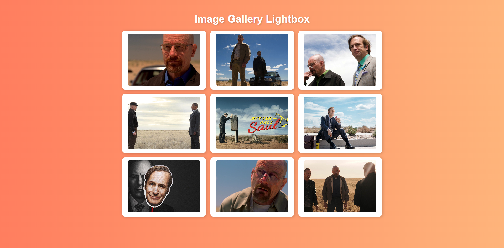

# **Image Gallery Lightbox**

## **Project Description**
This project implements an **image gallery** where clicking on a thumbnail opens a larger version of the image in a **modal (lightbox)**. The lightbox can be closed by either clicking on the "×" close button. The gallery is built using **HTML**, **CSS**, and **JavaScript**.

## **Important JavaScript Code**

### 1. **Open Lightbox on Image Click**
This code makes the lightbox appear when a thumbnail is clicked.
```js
img.addEventListener("click", () => {
    lightbox.classList.add("show");
    lightboxImg.src = img.src;
});
```
- **Explanation**:
  - When an image is clicked, the lightbox becomes visible (`.show` is added).
  - The `src` of the large image in the lightbox is set to the `src` of the clicked thumbnail.

### 2. **Close Button (×) Event Listener**
This code allows the user to close the lightbox by clicking on the close button (`×`).
```js
closeBtn.addEventListener("click", () => {
    lightbox.classList.remove("show");
});
```
- **Explanation**:
  - When the user clicks the close button (`×`), the `.show` class is removed from the lightbox, closing it.

---

## **Screenshots**
### Output 1: The Image Gallery
- **Gallery View**: A collage of 12 images arranged in a grid layout. Clicking any image will open it in the lightbox.
  
  

### Output 2: The Lightbox
- **Lightbox View**: A large version of the clicked image appears with a dark background overlay. The user can close the lightbox by clicking the close button (`X`).

  

---
