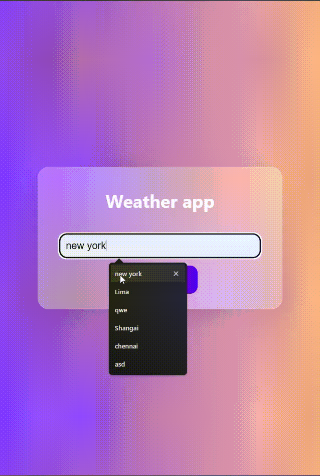

# Weather App  

## Overview  
This is a simple **Weather App** that fetches real-time weather data using the **OpenWeather API** and displays it in a user-friendly interface.  


## Output Screenshot  
  

## How It Works  

### API and JSON Integration  
The app makes an **HTTP request** to OpenWeather API using **fetch()** to retrieve weather data in JSON format.  

### API Key  
You need an API key from OpenWeather to access the data. It's defined in `script.js` as 'YOUR-API-KEY':    
🔹 Replace this key with your own from [OpenWeather](https://home.openweathermap.org/api_keys).  

### Fetching Weather Data  
The `getWeather()` function makes a **fetch request** to get weather data:  
```js
const currentWeatherUrl = `https://api.openweathermap.org/data/2.5/weather?q=${city}&appid=${apiKey}`;
fetch(currentWeatherUrl)
    .then(response => response.json())
    .then(data => {
        displayWeather(data);
    })
    .catch(error => {
        console.error('Error fetching current weather data:', error);
        alert('Error fetching current weather data. Please try again.');
    });
```
🔹 It dynamically constructs the API URL based on user input.  
🔹 Sends a **GET request** to fetch JSON data.  
🔹 Calls `displayWeather(data)` to update the UI.  

### Parsing JSON Response  
Inside `displayWeather(data)`, key information is extracted:  
```js
const temperature = Math.round(data.main.temp - 273.15); // Convert Kelvin to Celsius
const description = data.weather[0].description;
const iconCode = data.weather[0].icon;
const iconUrl = `https://openweathermap.org/img/wn/${iconCode}@4x.png`;
```
🔹 Extracts **temperature**, **weather condition**, and **weather icon URL** from JSON response.  
🔹 Updates the **DOM** dynamically.  

### Displaying Weather Data  
```js
tempDivInfo.innerHTML = `<p>${temperature}°C</p>`;
weatherInfoDiv.innerHTML = `<p>${cityName}</p><p>${description}</p>`;
weatherIcon.src = iconUrl;
weatherIcon.alt = description;
weatherIcon.style.display = 'block';
```
🔹 Updates **temperature, city name, and weather description**.  
🔹 Displays an **icon** representing the weather condition.  
