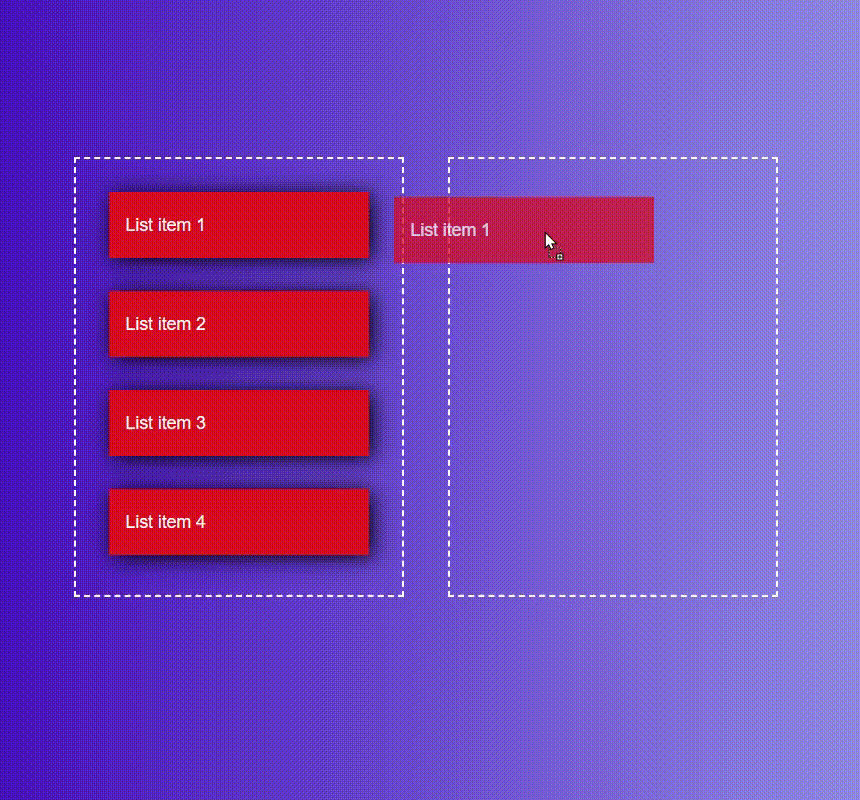

# Drag and Drop List Reordering

## Overview
This project implements a drag-and-drop functionality that allows users to reorder list items between two containers. It uses the **HTML5 Drag and Drop API** to manage drag events and update the **DOM** dynamically after a drop. Visual feedback is provided through styling.

## Output Screenshot  
  

1. **Selecting Items for Dragging**
   ```js
   let lists = document.getElementsByClassName("list");
   ```
   - Fetches all elements with class `list` (the draggable items).
   
2. **Drag Start Event**
   ```js
   list.addEventListener("dragstart", function(e){
       let selected = e.target;
   ```
   - Captures the dragged element when the user starts dragging.
   
3. **Drag Over Event** (Allows dropping by preventing default behavior)
   ```js
   rightBox.addEventListener("dragover", function(e){
       e.preventDefault();
   })
   ```
   
4. **Drop Event** (Moves the dragged item to the new container)
   ```js
   rightBox.addEventListener("drop", function(e){
       rightBox.appendChild(selected);
       selected = null;
   })
   ```
   - Appends the dragged item (`selected`) into the `rightBox`.
   - Resets `selected` to avoid unintended behavior.

5. **Reversibility (Dragging Back to Left Box)**
   ```js
   leftBox.addEventListener("drop", function(e){
       leftBox.appendChild(selected);
       selected = null;
   })
   ```
   - Users can drag items back to the left container if needed.
