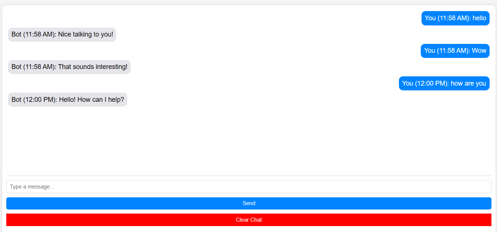

# **Real-Time Chat Simulation (Frontend-Only)**  

This is a **simple real-time chat simulation** built using **HTML, CSS, and JavaScript**. It simulates a **live chat experience** without a backend by using **setTimeout()** to generate bot responses dynamically. The chat history is **saved in `localStorage`**, so messages persist even after a page refresh.  

---

## **📸 Preview**  
  
---
## **📜 How It Works (JavaScript Breakdown)**  

### **1️⃣ Sending a User Message**  
When the user enters text and presses **Send** or **Enter**, `sendMessage()` runs:  
```js
document.getElementById("send-btn").addEventListener("click", function() {
    let userInput = document.getElementById("user-input").value;
    if (userInput.trim() === "") return; // Ignore empty messages

    let timestamp = new Date().toLocaleTimeString([], { hour: '2-digit', minute: '2-digit' });

    let messageDiv = document.createElement("div");
    messageDiv.classList.add("message", "user-message");
    messageDiv.textContent = `You (${timestamp}): ${userInput}`;
    document.getElementById("chat-box").appendChild(messageDiv);

    saveMessage(`You (${timestamp}): ${userInput}`, "user-message"); // Save chat history
    document.getElementById("user-input").value = ""; // Clear input
    scrollToBottom(); // Auto-scroll
    botReply(); // Generate bot response
});
```

### **2️⃣ Simulating the Bot Reply**  
After a **1.5-second delay**, the bot generates a random response:  
```js
function botReply() {
    let chatBox = document.getElementById("chat-box");

    // Show "Bot is typing..." indicator
    let typingIndicator = document.createElement("div");
    typingIndicator.classList.add("message", "bot-message");
    typingIndicator.textContent = "Bot is typing...";
    chatBox.appendChild(typingIndicator);
    scrollToBottom();

    setTimeout(() => {
        chatBox.removeChild(typingIndicator); // Remove typing indicator

        let responses = [
            "Hello! How can I help?",
            "That sounds interesting!",
            "Tell me more!",
            "I'm just a bot, but I'm here to chat!",
            "Nice talking to you!"
        ];
        let randomResponse = responses[Math.floor(Math.random() * responses.length)];
        let timestamp = new Date().toLocaleTimeString([], { hour: '2-digit', minute: '2-digit' });

        let botMessage = document.createElement("div");
        botMessage.classList.add("message", "bot-message");
        botMessage.textContent = `Bot (${timestamp}): ${randomResponse}`;
        chatBox.appendChild(botMessage);

        saveMessage(`Bot (${timestamp}): ${randomResponse}`, "bot-message"); // Save response
        scrollToBottom();
    }, 1500);
}
```

### **3️⃣ Saving Messages in `localStorage`**  
To prevent losing chat history on refresh, messages are stored locally:  
```js
function saveMessage(text, className) {
    let chatHistory = JSON.parse(localStorage.getItem("chatHistory")) || [];
    chatHistory.push({ text, className });
    localStorage.setItem("chatHistory", JSON.stringify(chatHistory));
}
```

### **4️⃣ Loading Messages on Page Load**  
When the page reloads, saved messages are retrieved and displayed:  
```js
window.onload = function() {
    let chatHistory = JSON.parse(localStorage.getItem("chatHistory")) || [];
    let chatBox = document.getElementById("chat-box");

    chatHistory.forEach(msg => {
        let messageDiv = document.createElement("div");
        messageDiv.classList.add("message", msg.className);
        messageDiv.textContent = msg.text;
        chatBox.appendChild(messageDiv);
    });

    scrollToBottom();
};
```

### **5️⃣ Clearing Chat History**  
A button allows users to **delete chat history**:  
```js
document.getElementById("clear-chat").addEventListener("click", function() {
    localStorage.removeItem("chatHistory"); // Delete from storage
    document.getElementById("chat-box").innerHTML = ""; // Clear chat UI
});
```

---