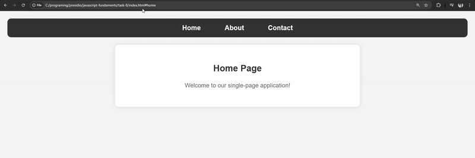

## **Single-Page Application (SPA) with Hash-based Routing**  

### **📌 Overview**  
This project demonstrates a simple **Single-Page Application (SPA)** using **hash-based routing** in JavaScript. It allows users to navigate between different views **without reloading the page**.  


---

## **📸 Output Preview**  
  

---


### **📝 `script.js` (JavaScript for Routing)**  
This file contains the **JavaScript logic** to handle hash-based routing.  

#### **✅ 1. Define Routes**  
We store the content for each page in an **object**:  
```js
const routes = {
    home: "<h2>Home Page</h2><p>Welcome to our simple SPA!</p>",
    about: "<h2>About Us</h2><p>We are learning JavaScript and building an SPA.</p>",
    contact: "<h2>Contact Us</h2><p>Email us at contact@example.com</p>",
};
```

#### **✅ 2. Function to Update Content Based on Hash**  
This function extracts the **hash value** and updates the content dynamically.  
```js
function loadContent() {
    const hash = location.hash.substring(1) || "home";  // Default to "home" if no hash is found
    document.getElementById("content").innerHTML = routes[hash] || "<h2>404 - Page Not Found</h2>";
}
```

#### **✅ 3. Listen for Hash Changes**  
Whenever the **hash changes**, the content updates **without refreshing** the page.  
```js
window.onhashchange = loadContent; // Update content when hash changes
window.onload = loadContent;       // Load correct page when site is opened
```

---
