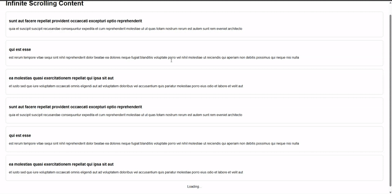

# 📜 Infinite Scrolling Content Loader

A simple web app that loads content automatically as the user scrolls to the bottom — powered by JavaScript and the [JSONPlaceholder API](https://jsonplaceholder.typicode.com/).

---
## **📸 Output Preview**  
  
---

## 🧠 How It Works

### 1. **Load Initial Data**

```javascript
loadPosts().then(ensureScrollableContent);
```
Loads the first batch of posts and ensures there's enough content to scroll.

---

### 2. **Fetching Data from API**

```javascript
async function loadPosts() {
  const res = await fetch(`https://jsonplaceholder.typicode.com/posts?_limit=${limit}&_page=${page}`);
  const data = await res.json();
  appendPosts(data);
  return data;
}
```
Fetches paginated posts from the JSONPlaceholder API using `limit` and `page`.

---

### 3. **Appending Posts to DOM**

```javascript
function appendPosts(posts) {
  posts.forEach(post => {
    const div = document.createElement('div');
    div.classList.add('post');
    div.innerHTML = `<h3>${post.title}</h3><p>${post.body}</p>`;
    postContainer.appendChild(div);
  });
}
```
Creates and inserts post elements dynamically.

---

### 4. **Scroll Detection**

```javascript
window.addEventListener('scroll', () => {
  const { scrollTop, scrollHeight, clientHeight } = document.documentElement;
  if (scrollTop + clientHeight >= scrollHeight - 10) {
    page++;
    loadPosts();
  }
});
```
Watches for when the user scrolls near the bottom of the page and triggers more content loading.

---

### 5. **Ensure Scroll Exists (Zoom Fix)**

```javascript
function ensureScrollableContent() {
  const isScrollable = document.documentElement.scrollHeight > window.innerHeight;
  if (!isScrollable) {
    page++;
    loadPosts().then(ensureScrollableContent);
  }
}
```
If the page isn’t tall enough to allow scrolling (e.g., due to zooming out), it loads more data until scrolling is possible.
